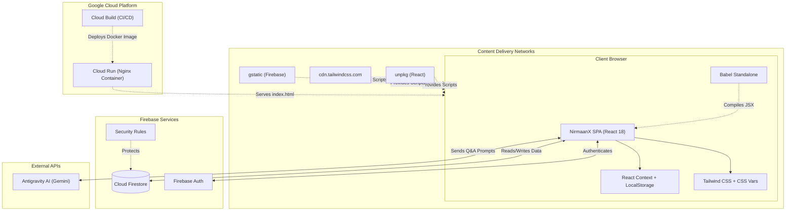

<div align="center">
  <h1>🇮🇳 NirmaanX</h1>
  <p><strong>Interactive Civic Education Platform for Indian Elections</strong></p>
  
  
  
  
  
  
</div>

<br />

## 📖 Overview

**NirmaanX** is a cutting-edge, single-page web application designed to educate students and citizens about the democratic processes of India. Built entirely within a **single, self-contained HTML[...]

From interactive timelines to a full-fledged mock voting simulator, NirmaanX gamifies civic education.

---

## ✨ Key Features

- 🎮 **Gamification System**: Earn "Democracy Points" (DP), rank up from *Novice* to *Chief Election Officer*, and unlock custom achievement badges.
- 🗺️ **Interactive Timeline**: Step-by-step roadmap of the election process from announcement to government formation.
- 🗳️ **Mock Voting Simulator**: A realistic 7-stage simulation of polling booths including EVM machine logic and VVPAT.
- 🎴 **Flashcards & Quizzes**: Learn terminology with 3D interactive flashcards and test your knowledge.
- ⚖️ **Comparison Tool**: Dynamic comparisons between democratic structures (e.g., Lok Sabha vs Rajya Sabha).
- 🤖 **ElectionBot AI**: Integrated AI chatbot ready for electoral Q&A (powered by Antigravity AI / Gemini).
- 🎨 **Dynamic Theme Switcher**: 6 built-in professional themes (Cream + Olive, Dark Mocha, etc.) applying global CSS variables natively.

---

## 🏗️ Architecture & Tech Stack

NirmaanX takes a highly optimized, no-build approach:
- **Frontend Framework**: React 18 + ReactDOM via UMD (unpkg).
- **JSX Compilation**: Babel Standalone running in-browser.
- **Styling**: Tailwind CSS (CDN) + Custom Vanilla CSS Variables for theming and glassmorphism.
- **Backend & Database**: Firebase 9 Compat SDK (Auth + Firestore).
- **Hosting / Deployment**: Google Cloud Run via Nginx containerization.

### 📐 System Flow



### 📂 Directory Structure

```text
NirmaanX/
├── index.html          # The entire application (React, Tailwind configs, logic, UI)
├── Dockerfile          # Containerization instructions for Nginx Alpine
├── nginx.conf          # Nginx server configuration (SPA routing, security headers)
├── cloudbuild.yaml     # CI/CD config for Google Cloud Build
├── deploy.sh           # Automated deployment script for Google Cloud Run
├── firebase.json       # Firebase configuration linking security rules
└── firestore.rules     # Cloud Firestore database security policies (Version 2)
```

---

## 🚀 Local Development

Since the app is a single HTML file, running it locally is incredibly simple:

1. Clone the repository:
   ```bash
   git clone https://github.com/supriya-cybertech/NirmaanX.git
   cd NirmaanX
   ```
2. Double-click `index.html` to open it in any modern browser.
   *(Note: For Firebase Auth and localStorage to work seamlessly, serving it via a local server like VS Code Live Server or `python -m http.server 8000` is recommended).*

---

## ☁️ Deployment (Google Cloud Run)

The repository includes everything needed for a zero-downtime deployment to Google Cloud Run.

**1. Make the deployment script executable:**
```bash
chmod +x deploy.sh
```

**2. Deploy to Cloud Run (Requires Google Cloud SDK):**
```bash
export PROJECT_ID=$(gcloud config get-value project)
./deploy.sh $PROJECT_ID
```
*The script automatically handles Docker building, Nginx port replacement, pushing to GCR, and deploying the service.*

---

## 🔐 Database Security

The `firestore.rules` file ensures data privacy:
- Users can only read and write their **own** data (`/users/{uid}`).
- The **Leaderboard** is publicly readable, but users can only write to their specific UID node.

---

## 🤝 Contributing
Contributions, issues, and feature requests are welcome! Feel free to check the issues page.

## 📝 License
This project is open-source and available under the [MIT License](LICENSE).
